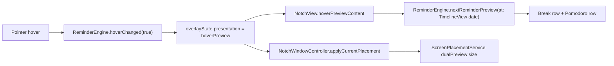

# Hover Next Reminders Preview - Solution Design

> Generated with `all-plan` and `build-macos-apps:swiftui-patterns`.

## Overview

**Goal**: When no reminder is due, hovering near the notch should expand the island and show the next sedentary break reminder time and the next Pomodoro phase reminder time together.

**Readiness Score**: 86/100

**Review Score**: 8.4/10

**Generated**: 2026-06-03

## Requirements Summary

### Problem Statement

The current hover preview only shows a generic "Next reminder soon" label. It does not tell the user when the next break reminder will happen, and when a Pomodoro session is active it can bias the hover content toward the Pomodoro countdown instead of showing both reminder modes at the same time.

### Scope

In scope:

- Add a glanceable hover preview state for the next sedentary break reminder.
- Add a glanceable hover preview state for the next Pomodoro focus/rest phase reminder.
- Show both modes together when both are enabled or active.
- Preserve the current staged notch expansion and dismissal motion.
- Preserve active reminder presentation behavior. This plan only changes the idle/hover preview surface.

Out of scope:

- Replacing the Pomodoro menu bar controls.
- Adding accounts, cloud sync, history storage, or a new dashboard.
- Copying GPL project code. GPL projects are visual/product references only.

### Success Criteria

- Hovering the tucked notch while no reminder is due expands into a compact two-mode preview.
- The sedentary row shows an absolute next time and relative remaining time when the reminder is available.
- The Pomodoro row shows the next focus/rest transition time when a session is running or paused.
- Disabled, paused, schedule-blocked, or not-started states render as muted status text instead of misleading times.
- Existing reminder pending, presenting, dismissal, voice overlay, and Pomodoro countdown behavior still pass tests.

### Assumptions

- "久坐" maps to the existing break reminder engine.
- "番茄钟下一次时间" means the next Pomodoro phase boundary: focus completion or break completion. If Pomodoro is enabled but idle, the preview should say it has not started rather than inventing a future time.
- The hover preview setting remains respected. If `hoverPreviewEnabled` is off, this new preview should not appear unless an existing persistent countdown already allows hover expansion.

## External Inspiration

| Project | License / Use | Useful idea |
| --- | --- | --- |
| DynamicNotchKit | MIT; safe to study/adapt ideas | Treat the notch as a SwiftUI-driven information surface and keep fallback support for Macs without a notch. |
| TomatoBar | MIT; safe to study/adapt ideas | Keep Pomodoro state simple: focus/rest durations, menu bar control, discreet notification timing. |
| Knook | MIT; safe to study/adapt ideas | Local-first break scheduling with heads-up timing, pause/postpone states, and no SaaS expansion. |
| Atoll | GPL-3.0; visual reference only | Hover expansion, compact utility modules, and animation customization. Do not copy code. |
| Boring.Notch | GPL-3.0; visual reference only | Hover-to-expand notch affordance and compact multi-feature island. Do not copy code. |

Adopted:

- Use a compact information surface instead of adding buttons to the hover preview.
- Use a two-mode glance summary rather than a single generic "soon" label.
- Keep all timing local and derived from existing engines.

Adapted:

- Dynamic Island-style visual hierarchy becomes a restrained macOS utility strip: two short cells with icon, label, time, and relative status.
- Break reminder scheduler ideas stay inside the existing `ReminderEngine` instead of adding a second scheduler.

Discarded:

- Broad tabbed notch hubs, media controls, file shelves, widgets, gestures, and large dashboards.
- GPL code or layout implementations.

## Architecture

### Approach

Add a computed preview model to the existing reminder runtime and render it from `NotchView` during `.hoverPreview`. This keeps ownership aligned with the current architecture: `ReminderEngine` owns reminder state, `ScreenPlacementService` owns geometry, `NotchWindowController` applies panel placement and hit testing, and `NotchView` owns visible SwiftUI rendering.

### Key Components

- **ReminderEngine.NextReminderPreview**: a lightweight value model with one break row and one Pomodoro row.
- **ReminderEngine.nextReminderPreview(at:)**: computes display state from active seconds, snooze date, schedule/manual pause/disabled state, and active Pomodoro countdown content.
- **NextReminderPreviewView**: a SwiftUI hover view that renders the two modes together with stable dimensions and monospaced times.
- **OverlaySizingRole.dualPreview**: a sizing role for two reminder rows, wider and taller than the current generic preview but no larger than the existing prominent countdown surface.
- **Localizable.strings**: labels and statuses for break, Pomodoro, disabled, paused, blocked, idle, and "less than 1 minute".
- **Unit tests**: focused tests for preview model computation and placement sizing.

### Data Flow



## Layout Plan

### Preferred Desktop Layout

Use a 2-column horizontal layout inside the expanded notch:

```text
┌──────────────────────────────────────────────┐
│                 physical notch               │
├──────────────────────┬───────────────────────┤
│  figure.stand        │  timer                │
│  久坐提醒             │  番茄钟                │
│  15:40 · 12分钟后     │  15:53 · 专注剩25分钟   │
└──────────────────────┴───────────────────────┘
```

Visual rules:

- Width target: 332-360 px, clamped by screen/notch constraints.
- Height target: 88-104 px depending on notch/menu bar inset.
- Two equal cells, no nested cards. Use subtle divider or spacing only.
- Break tint: green. Pomodoro focus tint: orange/yellow. Pomodoro rest tint: blue/teal.
- Primary time uses monospaced digits. Status text uses caption2 and `minimumScaleFactor`.
- If one mode is unavailable, keep the cell visible but muted so the layout does not jump.

### Narrow/Fallback Layout

If the available preview width is too small, stack rows vertically:

```text
figure.stand  久坐提醒      12分钟后 · 15:40
timer         番茄钟        未开始
```

This fallback prevents Chinese and Japanese localized labels from being squeezed into unreadable two-column cells.

### State Text Rules

Break row:

- Enabled and tracking: `12分钟后 · 15:40`
- Snoozed: `已稍后提醒 · 15:40`
- Manual pause: `已暂停`
- Break reminders disabled: `已关闭`
- Outside schedule: `不在提醒时段`
- Idle-suppressed: `活动后继续计时`

Pomodoro row:

- Running focus: `专注剩25分钟 · 15:53`
- Running rest: `休息剩5分钟 · 15:33`
- Paused: `已暂停 · 12分钟`
- Enabled but idle: `未开始`
- Disabled: `已关闭`

## Implementation Plan

### Step 1: Add Preview Model

- **Actions**: Add nested structs/enums in `ReminderEngine` for `NextReminderPreview` and `NextReminderPreview.Row`.
- **Deliverables**: A value model that carries icon, title key, display state, tint role, optional date, and optional remaining seconds.
- **Dependencies**: Existing `activeSeconds`, `breakSnoozedUntilDate`, `activePomodoroCountdownContent`, and preferences.

### Step 2: Compute Break Next Time

- **Actions**: Add `nextBreakPreview(at:)`.
- **Deliverables**: Correct row state for active tracking, snooze, manual pause, disabled reminders, schedule block, idle suppression, and active reminder suppression.
- **Dependencies**: Existing `runState`, `reminderInterval`, `minutesRemaining`, and `scheduleState`.

### Step 3: Compute Pomodoro Next Time

- **Actions**: Add `nextPomodoroPreview(at:)` from `activePomodoroCountdownContent` and preferences.
- **Deliverables**: Running/paused/idle/disabled row states without passing `PomodoroEngine` into the notch view.
- **Dependencies**: Existing `PomodoroCountdownContent`.

### Step 4: Replace Generic Hover Preview UI

- **Actions**: Replace `HoverPreviewView(topInset:)` with `NextReminderPreviewView(preview:topInset:)`; use `TimelineView(.periodic(...))` so relative time refreshes.
- **Deliverables**: Stable two-mode hover surface that shows both next reminder times.
- **Dependencies**: Preview model from Step 1.

### Step 5: Update Sizing

- **Actions**: Add `OverlaySizingRole.dualPreview` or reuse/refine `prominentCountdown` sizing if the computed width/height fits. Update `NotchWindowController.activeSizingRole` for `.hoverPreview` when rendering the dual preview.
- **Deliverables**: Enough room for two cells without making the transparent click area larger during hidden/tucked states.
- **Dependencies**: Existing `visibleSize` hit-testing behavior.

### Step 6: Localization

- **Actions**: Add keys in `en`, `zh-Hans`, `zh-Hant`, and `ja` string files.
- **Deliverables**: Localized labels and state text.
- **Dependencies**: Existing localization files.

### Step 7: Tests and Verification

- **Actions**: Add tests for preview computation and placement sizing; run the existing test suite.
- **Deliverables**: Verified behavior.
- **Commands**:
  - `xcodebuild -project NotchMove/NotchMove.xcodeproj -scheme NotchMove -destination 'platform=macOS' test`
  - `git diff --check`

## Technical Considerations

- Do not pass `PomodoroEngine` into `NotchWindowController` unless the existing `activePomodoroCountdownContent` is insufficient. The smaller change is to expose a summary from `ReminderEngine`.
- Avoid changing the reminder presentation state machine. Hover preview already has staged pending, active, and dismissing states; the feature should only change preview content and size.
- Keep hover content passive. Buttons in hover preview would compete with reminder action overlays and increase hit-testing risk.
- Use absolute time plus relative text. Relative-only text is less useful when the user wants to plan around a clock time.
- Use `TimelineView` with minute-level or 30-second refresh, not a new engine timer.

## Risk Management

| Risk | Impact | Likelihood | Mitigation |
| --- | --- | --- | --- |
| Hover island becomes too wide or tall for some notch/fallback displays | Medium | Medium | Add a sizing role with clamped dimensions and a stacked fallback layout. |
| Disabled/paused states show misleading next times | High | Medium | Treat row state as explicit enum cases instead of optional date formatting only. |
| Pomodoro active countdown loses current visual prominence | Medium | Medium | Use the Pomodoro cell with phase tint and remaining time; keep full countdown surfaces for actual Pomodoro reminder presentation. |
| Hit testing expands while the island is visually tucked | High | Low | Preserve `visibleSize` usage and only expose dual size during `.hoverPreview`. |
| Localization strings overflow | Medium | Medium | Use short labels, monospaced time, line limits, and `minimumScaleFactor`; verify Chinese/Japanese manually. |

## Acceptance Criteria

- [ ] Hover preview shows both 久坐提醒 and 番茄钟 cells together.
- [ ] Break row uses snooze time when snoozed.
- [ ] Break row uses remaining active interval when tracking.
- [ ] Break row shows muted state for disabled, manual pause, schedule block, or idle suppression.
- [ ] Pomodoro row shows next phase boundary when focus/rest is running.
- [ ] Pomodoro row shows paused remaining when paused.
- [ ] Pomodoro row shows "未开始" when enabled but idle.
- [ ] Hover expansion and dismissal still use the existing staged timing.
- [ ] Voice input overlay and active reminder overlays are unaffected.
- [ ] `xcodebuild ... test` and `git diff --check` pass.

## Review Summary

| Dimension | Score |
| --- | --- |
| Clarity | 9/10 |
| Completeness | 8/10 |
| Feasibility | 9/10 |
| Risk Assessment | 8/10 |
| Requirement Alignment | 8/10 |
| **Overall** | **8.4/10** |

Primary remaining decision: whether Pomodoro idle should always show a muted "未开始" cell or hide the Pomodoro cell when Pomodoro is disabled. The recommended MVP keeps the cell visible but muted for layout stability.
